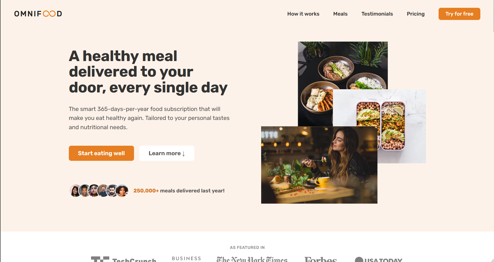

<br />
<div align="center">
  <h1 style="margin-bottom: 50px"> OMNIFOOD </h1>

 
</div>

# 🚩 Table of Contents

<<<<<<< HEAD
- [🚩 Table of Contents](#-table-of-contents)
  - [🚀 Live Demo](#-live-demo)
  - [💬 About The Project](#-about-the-project)
  - [📦 Built With](#-built-with)
  - [🌏 Getting Started](#-getting-started)
  - [🐾 Roadmap](#-roadmap)
  - [📞 Contact](#-contact)
>>>>>>> d16684781957b6b92fc7f1cb303e4bc782563871

## 🚀 Live Demo
 Link: https://myfirstbigproject-krystian.netlify.app
  
## 💬 About The Project
Omnifood project is a summary of my knowledge of HTML&CSS and web design.
This is my first major project since I started learning programming.

The project used HTML and CSS with CSS Grid and Flexbox.
Thanks to the use of media-queries, Omnifood is a fully responsive website that works on mobile devices, laptops and desktop computers.
An interesting functionality in the project is the hamburger menu on mobile devices and active links in the navigation to help you better browse the website.
The entire page is carefully designed with proper margins, padding, spacing and typography.
Omnifood use well-established website components and layout patterns professional-looking designs.
  

## 📦 Built With

<p align="center">
  <a href="https://skillicons.dev">
    
  </a>
</p>

##  🌏 Getting Started

1. Clone the repo

   ```sh
   git clone https://github.com/krystian2077/Omnifood
   ```
   

## 🐾 Roadmap

- Add register
- Add dark/light mode
- Add payment
- Add sending email

<!-- CONTACT -->
## 📞 Contact

Email: krystian.potaczek07@gmail.com

My phone number: 788-986-074

